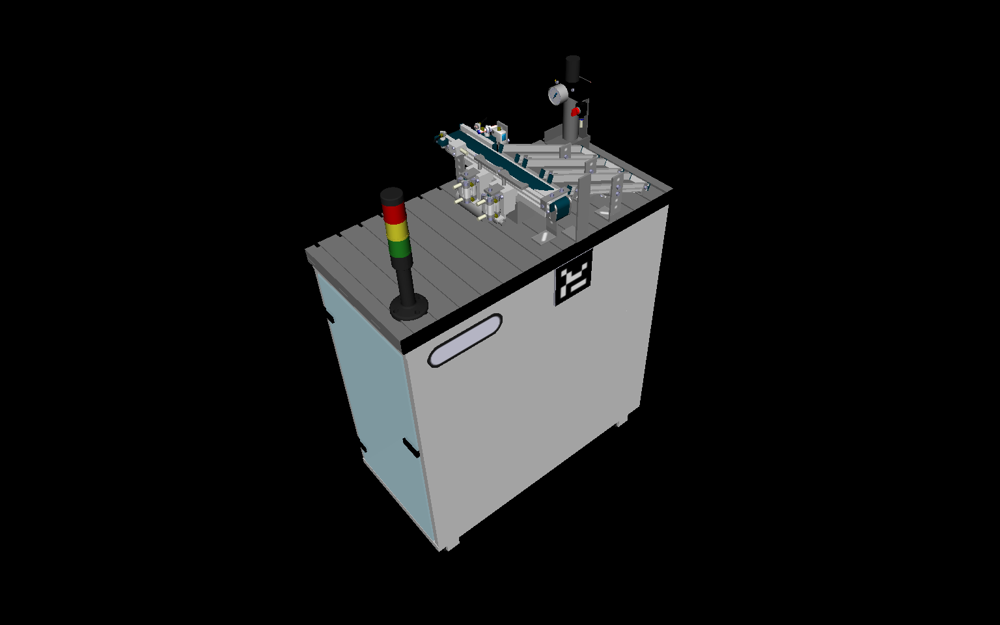
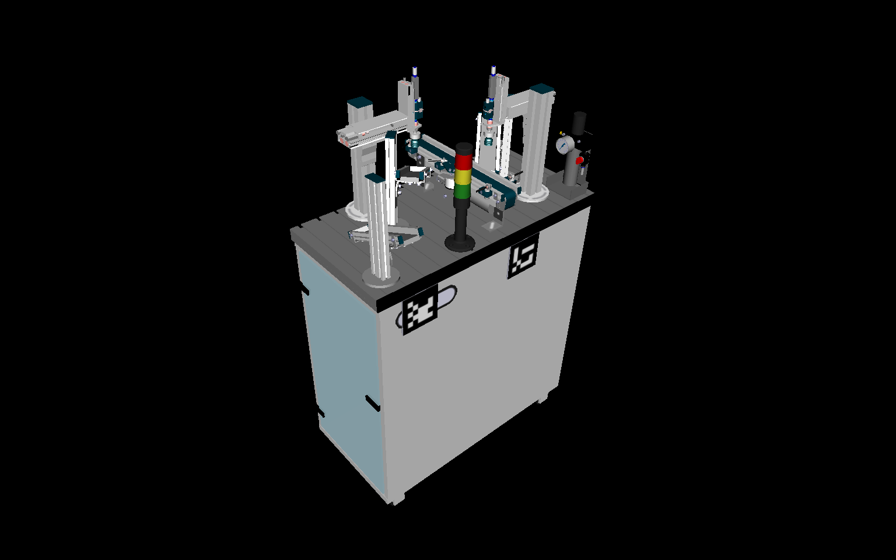

<!---
 This file is automatically generated by the script 'create_preview_list.py'. Any changes will be lost 
-->

## mps

### mps_base

* [mps_base.wrl](mps_base/mps_base.wrl?raw=true)

### mps_cap

* [mps_cap.wrl](mps_cap/mps_cap.wrl?raw=true)

### mps_delivery

* [mps_delivery.wrl](mps_delivery/mps_delivery.wrl?raw=true)

### mps_ring

* [mps_ring.wrl](mps_ring/mps_ring.wrl?raw=true)

