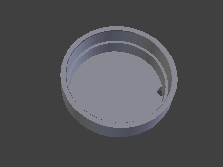

<!---
 This file is automatically generated by the script 'create_preview_list.py'. Any changes will be lost 
-->

### ring

* [ring.dae](ring.dae?raw=true)
* [ring.stl](ring.stl?raw=true)
* [ring.stp](ring.stp?raw=true)

